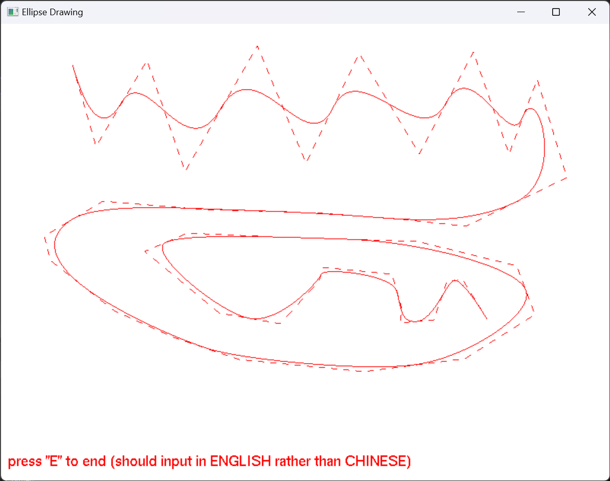

# simple-openl-graphic-tool

✨**基于 C++(MSVC) 和 OpenGL 的简单画图工具**✨ 通过橡皮筋技术动态绘制图形；Liang-Barsky 算法批量裁剪直线、折线；连续Bezier曲线、B样条的绘制；椭圆的中点 Bresenham 算法绘制椭圆。 

📌包含可执行文件，环境配置指南。

[个人网站：www.bytesc.top](http://www.bytesc.top) 

[个人博客：blog.bytesc.top](http://blog.bytesc.top)

🔔 如有项目相关问题，欢迎在本项目提出`issue`，我一般会在 24 小时内回复。

### 源代码

`C++` 源代码文件。如果在 `visual studio 2022` 以外的其它 `OpenGL` 环境运行，使用以下代码文件即可。
```txt
│  simple-openl-graphic-tool.cpp   # 主要源代码文件，项目入口
│  lineClipping.cpp  # Liang-Barsky 算法
│  lineClipping.h 
│  onMidPointEllispe.cpp # Bresenham 算法
│  onMidPointEllispe.h
```

## 页面展示

### Liang-Barsky 算法裁剪折线


右键选中 `Line` 菜单开始画图折线


键盘按 `P` 进入`画图`模式。（注意，所有键盘操作必须切换到英语输入法，中文输入法无效）

之后按住左键确定开始点，按住左键拖动画折线，松开左键即确定一个顶点，再按左键即可继续。


键盘按 `E` 进入`裁剪`模式。（注意，所有键盘操作必须切换到英语输入法，中文输入法无效）

按住左键拖动裁剪框，松开确定框的大小。


键盘按 `C` ，程序将使用 `Liang-Barsky` 算法按照裁剪框裁剪折线。 


### Bezier 曲线

右键菜单选中选项，进入 `Bezier` 曲线模式。按住左键拖动画折线。


按E结束曲线的绘制，自动显示相应的 `Bezier` 曲线。




### B 样条

右键菜单选中选项，进入 `B 样条` 模式。按住左键拖动画折线。


### Bresenham 算法画椭圆


右键选中 `ellipse` 菜单开始画椭圆


按住左键拖动，即可画图


可连续画多张图，右键选择`clear`菜单项可清空


按住左键拖动鼠标画图时，同时按住`shift`可以画正圆


## 运行环境

运行环境
- `windows 11`
- `Visual Studio 2022`
- `OpenGL`
    * `glfw-3.3.8.bin.WIN64`
    * `glutdlls37beta`

### 不配置环境

如果仅运行可执行文件，不修改和调试，无需配置环境。

可执行文件在项目目录下的 `x64/debug/simple-openl-graphic-tool.exe` 鼠标双击即可。

### 环境配置

配置方法参考这篇我转载的知乎文章 [VS2022的openGL环境搭建（完整篇）](https://zhuanlan.zhihu.com/p/486459964)

`Visual Studio 2022` 配置 `OpenGL` 所需相关资源和指南（转载非原创）在 `conf` 文件夹内。

`conf/Exported.vssettings` 文件为导出的 visual studio 配置

## 项目结构

### 源代码

`C++` 源代码文件。如果在 `visual studio 2022` 以外的其它 `OpenGL` 环境运行，使用以下代码文件即可。
```txt
│  simple-openl-graphic-tool.cpp   # 主要源代码文件，项目入口
│  lineClipping.cpp  # Liang-Barsky 算法
│  lineClipping.h 
│  onMidPointEllispe.cpp # Bresenham 算法
│  onMidPointEllispe.h
```

### vs 工程目录

`visual studio 2022` 工程目录
```txt
│  .gitignore
│  LICENSE
│  lineClipping.cpp
│  lineClipping.h
│  onMidPointEllispe.cpp
│  onMidPointEllispe.h
│  packages.config
│  README.md
│  simple-openl-graphic-tool.cpp   # 主要源代码文件，项目入口
│  simple-openl-graphic-tool.sln
│  simple-openl-graphic-tool.vcxproj
│  simple-openl-graphic-tool.vcxproj.filters
│  simple-openl-graphic-tool.vcxproj.user
│
├─conf
│      conf.pdf  # 配置指南
│      Exported.vssettings # 导出的visual-studio配置
│      glad.zip
│      glfw-3.3.8.bin.WIN64.zip
│      glutdlls37beta.zip
│
├─packages
├─readme_img
│
└─x64
    ├─Debug
    │  │  freeglut.dll
    │  │  glew32.dll
    │  │  glewinfo.exe
    │  │  glfw3.dll
    │  │  simple-openl-graphic-tool.exe  # 可执行文件入口
    │  │  simple-openl-graphic-tool.exe.recipe
    │  │  simple-openl-graphic-tool.ilk
    │  │  simple-openl-graphic-tool.log
    │  │  simple-openl-graphic-tool.obj
    │  │  simple-openl-graphic-tool.pdb
    │  │  simple-openl-graphic-tool.vcxproj.FileListAbsolute.txt
    │
    └─Release
        │  freeglut.dll
        │  glew32.dll
        │  glewinfo.exe
        │  glfw3.dll
        │  lineClipping.obj
        │  onMidPointEllispe.obj
        │  simple-openl-graphic-tool.exe  # 可执行文件入口
        │  simple-openl-graphic-tool.exe.recipe
        │  simple-openl-graphic-tool.iobj
        │  simple-openl-graphic-tool.ipdb
        │  simple-openl-graphic-tool.log
        │  simple-openl-graphic-tool.obj
        │  simple-openl-graphic-tool.pdb
        │  simple-openl-graphic-tool.vcxproj.FileListAbsolute.txt
       
```

## 运行方法

### 运行
运行可执行文件无需配置环境，鼠标双击打开 `x64/debug/simple-openl-graphic-tool.exe`

### 调试
先按照上文配置环境，然后用 `Visual Studio 2022` 打开 `simple-openl-graphic-tool.sln`，源码文件为 `simple-openl-graphic-tool.cpp`

调试前，需要把以下文件从生成中排除，方法如下图：

```txt
│  lineClipping.cpp
│  lineClipping.h
│  onMidPointEllispe.cpp
│  onMidPointEllispe.h
```


也可从`conf/Exported.vssettings` 导入的visual-studio配置


点击`浏览` 找到并选择 `conf/Exported.vssettings` 


# 开源许可证

此翻译版本仅供参考，以 LICENSE 文件中的英文版本为准

MIT 开源许可证：

版权所有 (c) 2023 bytesc

特此授权，免费向任何获得本软件及相关文档文件（以下简称“软件”）副本的人提供使用、复制、修改、合并、出版、发行、再许可和/或销售软件的权利，但须遵守以下条件：

上述版权声明和本许可声明应包含在所有副本或实质性部分中。

本软件按“原样”提供，不作任何明示或暗示的保证，包括但不限于适销性、特定用途适用性和非侵权性。在任何情况下，作者或版权持有人均不对因使用本软件而产生的任何索赔、损害或其他责任负责，无论是在合同、侵权或其他方面。